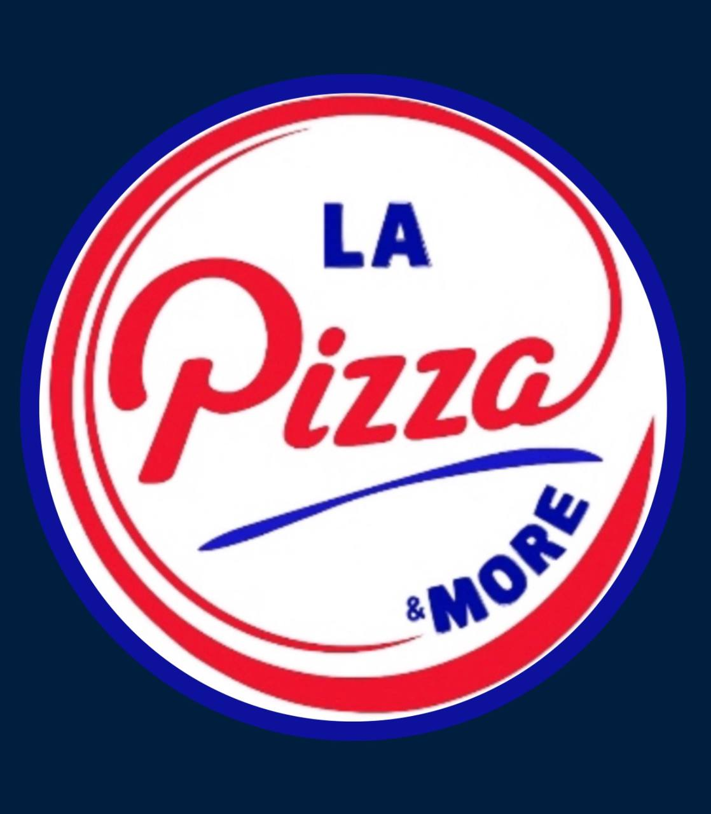

<!DOCTYPE html>
<html lang="ku">
<head>
<meta charset="UTF-8">
<meta name="viewport" content="width=device-width, initial-scale=1.0, user-scalable=no">
<title>LA Pizza Quiz</title>

</head>
<body>

    

    <h2>ناوت بنوسە بۆ دەستپێکردنی Quiz</h2>
    <input type="text" id="username" placeholder="ناوت لێرە بنوسە">
     
    <button onclick="startQuiz()">دەستپێکردن</button>

    
کات: 10

    

    

    

</body>
</html>
